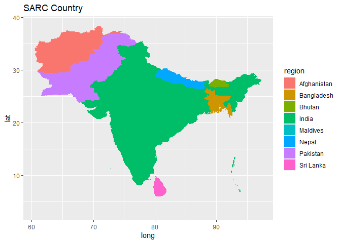
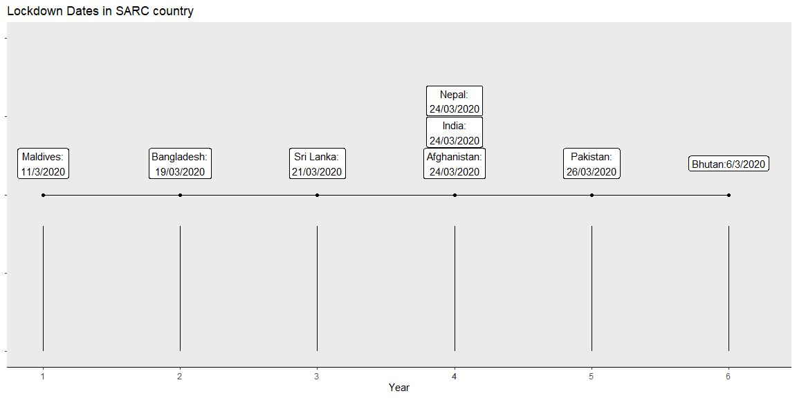

**Situation of COVID-19 in SAARC**
==================================

**Background**
--------------

*The ongoing pandemic of COVID-19 is caused by severe acute respiratory
syndrome coronavirus 2 (SARS-CoV-2). The outbreak was first identified
in Wuhan, Hubei, China in December 2019 and recognized as a pandemic by
the WHO on 11 March 2020. It has been spread to almost 232 countries
till now. Compared with North America, Western Europe and East Asia,
South Asia is one of the most populous and least developed world regions
and is considered highly vulnerable to any large scale outbreak of an
infectious disease. For this article I will try to answer few of the
question on condition of SAARC country.*

Why SAARC Country are at high risk?
-----------------------------------

**There are many factors which give clear hit of possible out break in
SAARC country. One of the biggest factor is population density.
Population density in the sub-continent is among the highest. Moreover,
most of them are in urban slums and cramped space with absolute scarcity
of good health facility. Another factor is poverty. About one third of
the world’s poor live in SAARC country. Income per capita is just about
10% that of the world and mere 4% of that in industrialized country. Due
to such extreme poverty, it is very hard to manage guideline provided by
WHO in term of Nutrition and Sanitation. Awareness program cannot be
effectively carried out and health facility isn’t in every one’s reach.
To make matter even worse, the doctor-patient ratio in other South Asian
countries are, 7.77 in India, 9.75 in Pakistan, 9.5 in Sri Lanka, 6.5 in
Nepal, 8.6 in Myanmar, and 22.3 in Maldives, WHO data states. Moreover,
the nurses-patient ratio in South Asian countries are, 21.07 in India,
21.15 in Sri Lanka, 26.85 in Nepal, 15.09 in Bhutan, 9.79 in Myanmar, 5
in Pakistan and 3.02 in war torn Afghanistan.Also,there is not even 1
ICU bed per 1000 in these country.These are not good figures certainly.
More of country like Afghanistan is in middle of internal terror and
Bangladesh has Rohingya Muslim issue still pending. All these are strong
evidence to suggest that SAARC country are in real threat of possible
outbreak. It will be almost impossible for SAARC country to stop this
pandemic if it spreads. So early measures need to be taken.**

Measures taken by SAARC country to stop COVID-19 to spread?
-----------------------------------------------------------

 **It was
necessary for south Asian country to take action as early as it was
possible for not letting pandemic to transmit in community. There were
different measures taken in order to stop this pandemic. The lockdown
imposed by Government of Nepal, Sri Lanka, Bangladesh, which started as
early as end of March when there was very few case. School and
university were closed and strict rules such as 5 people cannot be
gathered in any place were strictly implemented. The common purpose is
to break the chain of transmission through physical distancing. Other
initiation that were taken are borders were sealed, all international
flights were stopped very early, massive number of awareness campaigns
were carried out. To deal with the COVID-19 situation SAARC country
stressed the new way and means to jointly play role to sustain the
situation. It was very important for Nepal because of open border with
India. SAARC country also have created a fund to support each other for
tackling COVID-19.**

What does the data suggest?
---------------------------

 **Despite
early measures, number of infection in India, Pakistan, Afghanistan and
Bangladesh is very high. Maldives, Sri Lanka and Nepal are in
triple-digit whereas Bhutan have only double digit infected case. India
having highest population among SAARC country, the number of infection
is also high.The graph above shows that country India,Pakistan and
Bangladesh showing a exponential grouth and other country seems linear.
But if we make individual plot of each country it shows exponential
trend.We might see liner in these graph but its is so beacuse of
relative comparision.So it is not wise to interprate or compare as
population size and land mass difference.Also many of these country are
in their initial phase of pandemic, so most of them have not reach their
peak.These are only the initial number ,dyanamics can be changed real
soon if not properly handel.**

**If we see death data, in comparison to western world, death rate is
relatively lower. Countries like Nepal and Bhutan have no death till
date and India having most number of death in SAARC country.If we see
above plot of infection to death ratio,india’s ratio seems to be higer
which is ovious as they have higer number of infection.Dispite pakistan
not taking strong measures like other country have done,death is not
much.(Data are mostly based in hospital death,it may not be actual
figure of any other county) **

Figure suggested by these data can be calm tide before tsunami
==============================================================

Is this the real scenario?
--------------------------

**I hope all the statistic be true. But situation may not be exactly
what data suggest .The number of infection is almost certainly
underestimated, as testing have been nowhere near enough ,given the
scarcity of testing kit, well equipped and trained health professional
and massive population size. Lack of awareness, proper access to health
facility and sanitation item and cramped space, making us hard to trust
this figure. Moreover, SAARC country have already crossed 40+ days of
lockdown and for these country where 90% of the workforce is made up of
the self-employed, casual labor on daily wages and informal worker, it
will be very hard to extend this further. This situation can be the
cause of outbreak in these country.**
